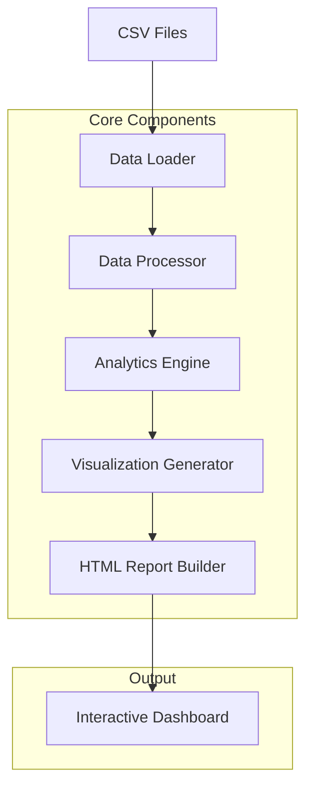

# Design Document

## Overview

The Prowler Security Insights Dashboard is a Python-based data analysis and visualization tool that processes multiple Prowler CSV files to generate an interactive HTML dashboard. The system will automatically discover and parse security scan data from multiple AWS accounts, perform comprehensive analysis, and generate a self-contained web interface for exploring security findings and trends.

The solution follows a modular architecture with clear separation between data processing, analysis, visualization, and report generation components. The output is a single HTML file with embedded JavaScript and CSS that provides rich interactivity without external dependencies.

## Architecture

### High-Level Architecture



### Component Architecture

The system consists of five main components:

1. **Data Loader**: Discovers and loads CSV files from the output directory
2. **Data Processor**: Cleans, validates, and normalizes the Prowler data
3. **Analytics Engine**: Performs statistical analysis and generates insights
4. **Visualization Generator**: Creates interactive charts and graphs using Plotly
5. **HTML Report Builder**: Assembles the final dashboard with embedded assets

## Components and Interfaces

### 1. Data Loader (`data_loader.py`)

**Purpose**: Automatically discover and load Prowler CSV files

**Key Methods**:
- `discover_csv_files(directory: str) -> List[str]`: Find all Prowler CSV files
- `load_csv_data(file_path: str) -> pd.DataFrame`: Load and parse individual CSV
- `combine_datasets(dataframes: List[pd.DataFrame]) -> pd.DataFrame`: Merge all data

**Input**: Directory path containing Prowler CSV files
**Output**: Combined pandas DataFrame with all security findings

### 2. Data Processor (`data_processor.py`)

**Purpose**: Clean, validate, and enrich the raw Prowler data

**Key Methods**:
- `clean_data(df: pd.DataFrame) -> pd.DataFrame`: Remove invalid records
- `normalize_severity(df: pd.DataFrame) -> pd.DataFrame`: Standardize severity levels
- `extract_compliance_frameworks(df: pd.DataFrame) -> pd.DataFrame`: Parse compliance data
- `enrich_with_metadata(df: pd.DataFrame) -> pd.DataFrame`: Add derived fields

**Transformations**:
- Parse semicolon-delimited format
- Normalize severity levels (critical, high, medium, low)
- Extract compliance framework mappings
- Add account groupings and regional classifications

### 3. Analytics Engine (`analytics.py`)

**Purpose**: Generate security insights and statistical analysis

**Key Methods**:
- `calculate_summary_stats(df: pd.DataFrame) -> Dict`: Overall security metrics
- `analyze_trends_by_account(df: pd.DataFrame) -> Dict`: Account-level analysis
- `identify_top_risks(df: pd.DataFrame) -> Dict`: Critical findings analysis
- `compliance_analysis(df: pd.DataFrame) -> Dict`: Framework compliance status
- `generate_recommendations(df: pd.DataFrame) -> List[Dict]`: Actionable insights

**Analytics Outputs**:
- Total findings by severity and status
- Top failing services and check types
- Regional distribution of security issues
- Compliance framework violation summaries
- Account-level security posture scores

### 4. Visualization Generator (`visualizations.py`)

**Purpose**: Create interactive charts and graphs using Plotly

**Key Methods**:
- `create_severity_distribution_chart(data: Dict) -> str`: Pie chart of severity levels
- `create_account_comparison_chart(data: Dict) -> str`: Bar chart comparing accounts
- `create_service_heatmap(data: Dict) -> str`: Heatmap of service vulnerabilities
- `create_compliance_dashboard(data: Dict) -> str`: Compliance framework status
- `create_regional_analysis(data: Dict) -> str`: Geographic distribution

**Chart Types**:
- Interactive pie charts for severity distribution
- Horizontal bar charts for top failing services
- Heatmaps for account vs service analysis
- Stacked bar charts for compliance frameworks
- Geographic visualizations for regional analysis

### 5. HTML Report Builder (`report_builder.py`)

**Purpose**: Generate the final interactive HTML dashboard

**Key Methods**:
- `build_html_structure() -> str`: Create base HTML template
- `embed_css_styles() -> str`: Include responsive CSS
- `embed_javascript() -> str`: Add interactivity and filtering
- `generate_dashboard(analytics: Dict, charts: Dict) -> str`: Assemble final report

**Features**:
- Responsive Bootstrap-based layout
- Embedded Plotly.js for charts
- Interactive filtering and search
- Export functionality for filtered data
- Print-friendly styling

## Data Models

### Core Data Structure

```python
@dataclass
class SecurityFinding:
    finding_uid: str
    account_uid: str
    account_name: str
    check_id: str
    check_title: str
    severity: str  # normalized: critical, high, medium, low
    status: str    # PASS, FAIL, MANUAL, INFO
    service_name: str
    region: str
    resource_type: str
    resource_name: str
    description: str
    remediation_text: str
    compliance_frameworks: List[str]
    timestamp: datetime
```

### Analytics Data Models

```python
@dataclass
class SecurityMetrics:
    total_findings: int
    findings_by_severity: Dict[str, int]
    findings_by_status: Dict[str, int]
    unique_accounts: int
    unique_services: int
    unique_regions: int

@dataclass
class AccountAnalysis:
    account_id: str
    account_name: str
    total_findings: int
    critical_findings: int
    security_score: float  # 0-100 based on findings
    top_failing_services: List[str]
    compliance_gaps: List[str]
```

## Error Handling

### Data Loading Errors
- **Malformed CSV files**: Log error, skip file, continue processing
- **Missing required columns**: Attempt to map similar columns, warn user
- **Empty files**: Log warning, exclude from analysis
- **Permission errors**: Provide clear error message with file path

### Data Processing Errors
- **Invalid severity values**: Map to "unknown" category, log for review
- **Missing account information**: Use filename to extract account ID
- **Timestamp parsing errors**: Use file modification date as fallback
- **Encoding issues**: Attempt multiple encodings (utf-8, latin-1, cp1252)

### Visualization Errors
- **Insufficient data**: Display informational message instead of chart
- **Large datasets**: Implement data sampling for performance
- **Browser compatibility**: Provide fallback static images for old browsers

## Testing Strategy

### Unit Testing
- **Data Loader**: Test CSV parsing with various file formats and edge cases
- **Data Processor**: Validate data cleaning and normalization logic
- **Analytics Engine**: Verify statistical calculations and insight generation
- **Visualization Generator**: Test chart generation with different data scenarios
- **HTML Report Builder**: Validate HTML structure and embedded assets

### Integration Testing
- **End-to-end workflow**: Process sample Prowler data through entire pipeline
- **Multi-account scenarios**: Test with various account configurations
- **Large dataset handling**: Performance testing with substantial data volumes
- **Browser compatibility**: Test dashboard functionality across browsers

### Test Data
- Create synthetic Prowler CSV files with known patterns
- Include edge cases: empty files, malformed data, missing columns
- Test with real anonymized Prowler output for validation
- Performance benchmarks with datasets of varying sizes

### Performance Requirements
- **Processing time**: Handle 100,000+ findings in under 60 seconds
- **Memory usage**: Process large datasets without exceeding 2GB RAM
- **Dashboard loading**: Interactive dashboard loads in under 5 seconds
- **Export functionality**: CSV exports complete in under 30 seconds

## Security Considerations

### Data Privacy
- No external API calls or data transmission
- All processing occurs locally
- Generated HTML contains no sensitive credentials
- Option to anonymize account names and IDs in output

### Input Validation
- Validate CSV file structure before processing
- Sanitize all user inputs for HTML generation
- Prevent code injection in dynamic content
- Validate file paths to prevent directory traversal

## Deployment and Usage

### System Requirements
- Python 3.8+ with pandas, plotly, and jinja2 libraries
- Minimum 4GB RAM for large datasets
- Modern web browser for dashboard viewing

### Usage Workflow
1. Place Prowler CSV files in the `output/` directory
2. Run the Python script: `python generate_prowler_scan_insights.py`
3. Open the generated `prowler_scan_insights.html` file in a web browser
4. Use interactive filters to explore findings and export results