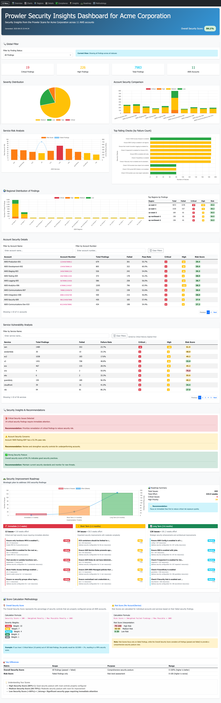

# Prowler Security Insights Dashboard

A Python tool that processes [Prowler](https://prowler.com/) security scan results from AWS accounts and generates an interactive security insights dashboard with executive-level analytics and actionable recommendations.

**Note**: This tool has been developed and tested specifically with AWS Prowler scan results. Scan results generated from other cloud providers (Azure, GCP) have not been tested & integrated yet.

## Table of Contents

- [Motivation](#motivation)
- [Key Features](#key-features)
- [Documentation](#documentation)
- [Quick Start](#quick-start)
- [Command Line Options](#command-line-options)
- [Data Requirements](#data-requirements)
- [Project Structure](#project-structure)
- [Troubleshooting](#troubleshooting)
- [License](#license)



## Motivation
Prowler provides a [dashboard](https://docs.prowler.com/projects/prowler-open-source/en/latest/tutorials/dashboard/) for diving into individual findings across multi-account AWS environments. However, when dealing with high volumes of findings, it becomes difficult to get an executive summary. This tool addresses that need by providing high-level analytics and actionable insights.

Note: Compliance-specific findings are not summarized in this report. Use the [Prowler Dashboard's](https://docs.prowler.com/projects/prowler-open-source/en/latest/tutorials/dashboard/) compliance check screen for detailed compliance standards review.

## Key Features

- **Multi-Account Analysis**: Process security findings from multiple AWS accounts simultaneously
- **Interactive Visualizations**: Rich charts and graphs with hover tooltips and dynamic filtering
- **Security Insights**: Automated recommendations based on finding patterns and severity
- **Self-Contained Dashboard**: Single HTML file with embedded assets - no external dependencies
- **Executive Summary**: Focus on key metrics and actionable insights rather than raw data
- **Advanced Filtering**: Real-time filtering by account, service, and finding status
- **Company Branding**: Optional company name integration for professional reporting

## Documentation

This project includes comprehensive documentation for different audiences:

### **README.md** (This File)
**Purpose**: Getting started guide for end users and security teams
- Installation and setup instructions
- Basic usage and command examples
- Quick troubleshooting for common issues
- Project overview and key features

### **SCAN-INSIGHTS-DASHBOARD.md**
**Purpose**: Technical reference for developers and advanced users
- **Dashboard Features**: Detailed specifications of all charts, tables, and interactive elements
- **Calculation Methodology**: Mathematical formulas for security scores and risk calculations
- **Data Processing Pipeline**: How CSV files are loaded, cleaned, and normalized
- **Architecture & Implementation**: Code structure, components, and technical design
- **Advanced Troubleshooting**: Debug procedures, error handling, and performance optimization

**When to use SCAN-INSIGHTS-DASHBOARD.md:**
- Understanding how security scores are calculated
- Implementing custom analytics or modifications
- Debugging data processing issues
- Contributing to the codebase
- Integrating with other security tools

For detailed dashboard features, calculations, and usage instructions, see [SCAN-INSIGHTS-DASHBOARD.md](SCAN-INSIGHTS-DASHBOARD.md).


## Quick Start

### Prerequisites
- Python 3.8 or higher
- Prowler CSV scan files from AWS environments

**Important**: This tool is currently tested and supported only for AWS Prowler scans. Support for other cloud providers (Azure, GCP, etc.) has not been implemented or tested.

### Installation
1. **Set up virtual environment**
   ```bash
   python -m venv venv
   source venv/bin/activate  # On macOS/Linux
   ```

2. **Install dependencies**
   ```bash
   ./venv/bin/python -m pip install -r requirements.txt
   ```

### Basic Usage
1. **Place Prowler CSV files** in the `output/` directory
2. **Generate dashboard**:
   ```bash
   ./venv/bin/python generate_prowler_scan_insights.py
   ```
3. **Open dashboard**: `open prowler_scan_insights.html`

Sample Dashboard: See `sample-scan-insights/prowler_scan_insights-sample.html` for a working example with sample data.

## Command Line Options

```bash
./venv/bin/python generate_prowler_scan_insights.py [OPTIONS]

Options:
  --output-dir OUTPUT_DIR     Directory containing Prowler CSV files (default: output)
  --dashboard-file FILENAME   Output filename (default: prowler_scan_insights.html)
  --company-name COMPANY_NAME Company name for dashboard branding (optional)
  --log-level LEVEL          Logging level (default: INFO)
  --help                     Show help message
```

**Examples:**
```bash
# Basic usage
./venv/bin/python generate_prowler_scan_insights.py

# With company branding
./venv/bin/python generate_prowler_scan_insights.py --company-name "Acme Corp"

# Custom output location
./venv/bin/python generate_prowler_scan_insights.py --output-dir ./scans --dashboard-file report.html

# Debug mode
./venv/bin/python generate_prowler_scan_insights.py --log-level DEBUG
```

## Project Structure

```
prowler-security-insights/
├── Documentation
│   ├── README.md                       # Main project documentation (this file)
│   ├── SCAN-INSIGHTS-DASHBOARD.md      # Technical reference & implementation details
│   ├── CONTRIBUTING.md                 # Development guidelines
│   ├── CODE_OF_CONDUCT.md              # Community guidelines
│   └── LICENSE                         # Project license
│
├── Core Application
│   ├── generate_prowler_scan_insights.py # Main entry point script
│   ├── data_loader.py                  # CSV file discovery and loading
│   ├── data_processor.py               # Data cleaning and normalization
│   ├── analytics.py                    # Security analytics and scoring
│   ├── visualizations.py               # Interactive chart generation
│   └── report_builder.py               # HTML dashboard assembly
│
├── Configuration & Dependencies
│   ├── requirements.txt                # Python package dependencies
│   ├── pytest.ini                     # Test configuration
│   └── .gitignore                     # Git ignore patterns
│
├── Data Directories
│   ├── output/                         # Prowler CSV input files (AWS scans)
│   ├── sample-scan-insights/           # Sample dashboard and screenshots
│   └── logs/                           # Processing logs (auto-generated)
│
├── Development & Testing
│   ├── tests/                          # Comprehensive test suite
│   │   ├── test_unit_*.py             # Unit tests for core modules
│   │   ├── test_integration_*.py      # Integration tests
│   │   ├── test_performance.py       # Performance benchmarks
│   │   ├── verify_project.py         # Project structure validation
│   │   └── run_all_tests.py          # Test runner
│   ├── venv/                          # Python virtual environment
│   ├── htmlcov/                       # Test coverage reports
│
├── Development Tools
│   ├── .kiro/                         # Kiro IDE configuration
```

For detailed information about analytics calculations, chart implementations, and dashboard features, see [SCAN-INSIGHTS-DASHBOARD.md](SCAN-INSIGHTS-DASHBOARD.md).

## Data Requirements

**AWS Prowler Scans Only**: This tool is designed for and tested with AWS Prowler scan results. Other cloud providers are not currently supported.

The tool expects Prowler CSV files with standard AWS columns including:
- **Required**: `FINDING_UID`, `ACCOUNT_UID`, `CHECK_ID`, `STATUS`, `SEVERITY`, `SERVICE_NAME`, `REGION`
- **Optional**: `ACCOUNT_NAME`, `CHECK_TITLE`, `DESCRIPTION`, `REMEDIATION_RECOMMENDATION_TEXT`, etc.

**File Discovery**: Automatically finds `*.csv`, `*prowler*.csv`, and `*security*.csv` files in the output directory.

For complete data format specifications, see [SCAN-INSIGHTS-DASHBOARD.md](SCAN-INSIGHTS-DASHBOARD.md#data-processing-pipeline).

## Troubleshooting

### Common Issues
| Issue | Solution |
|-------|----------|
| **No CSV files found** | Ensure Prowler CSV files are in the `output/` directory |
| **Missing columns** | Verify CSV files contain expected Prowler output structure |
| **Dashboard appears empty** | Check browser console for errors; verify CSV data format |
| **Memory issues** | Process smaller batches of CSV files |
| **Chart rendering issues** | Validate CSV data format and check browser console |

### Debug Mode
```bash
./venv/bin/python generate_prowler_scan_insights.py --log-level DEBUG
```

### Log Files
Processing logs are saved to `logs/` directory with timestamps.

For comprehensive troubleshooting guide, see [SCAN-INSIGHTS-DASHBOARD.md](SCAN-INSIGHTS-DASHBOARD.md#troubleshooting--debugging).

## Advanced Usage & Technical Details

For developers, security engineers, and advanced users who need deeper technical understanding:

**See [SCAN-INSIGHTS-DASHBOARD.md](SCAN-INSIGHTS-DASHBOARD.md) for:**
- Complete security score calculation formulas and methodology
- Detailed specifications of all dashboard charts and interactive features
- Data processing pipeline and CSV format requirements
- Code architecture, components, and implementation details
- Advanced debugging procedures and performance optimization
- Technical troubleshooting for complex issues

This technical documentation is essential for customizing the tool, contributing code, or integrating with other security platforms.